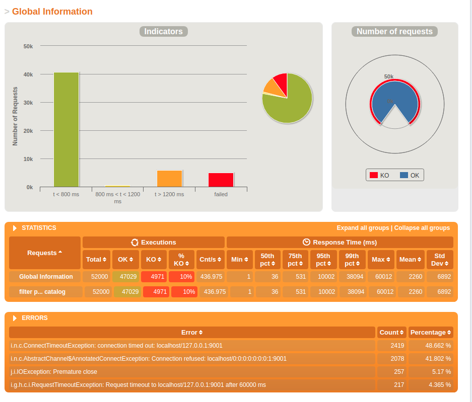

# reactive-lab

### Gatling results for first task:
- 13000 users is the 'reasonable limit'
- 3 request per user in random (< 5 seconds) periods in 1 minute
- each user fetches: 
```
{
 "brand": "gerber",
 "productKeyWords": ["cream"]
}
```

I've used 1 instance of http server combined with 3 workers that send requests to 6 searching actors
